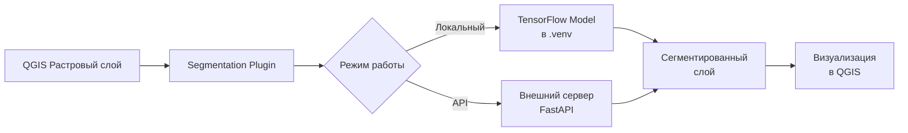

# 🛰️ Segmentation Plugin for QGIS

<div align="center">


<h3>🌍 Плагин QGIS для автоматической семантической сегментации спутниковых снимков</h3>

[Демо](#-демонстрация) • [Установка](#-установка) • [Использование](#-использование)

</div>

---

## 📸 Демонстрация

### 🚀 Первый запуск и автоматическая настройка окружения
<div align="center">
  
</div>

### 🖥️ Локальный инференс
<div align="center">
  
</div>

### 🌐 Инференс через API (render.com)
<div align="center">
  
</div>

### 🏠 Локальный бэкенд
<div align="center">
  
</div>

## ✨ Возможности

<table>
<tr>
<td width="50%">

### 🔧 Основные функции

- **6 классов сегментации** с высокой точностью
- **Локальный инференс** без интернета
- **API инференс** через внешний сервер
- **Автоматическая установка** окружения
- **Сохранение настроек** между сессиями

</td>
<td width="50%">

### 🎨 Классы объектов

| Класс | Цвет | Hex |
|-------|------|-----|
| 🏠 Здания |  | `#3C1098` |
| 🌍 Земля |  | `#8429F6` |
| 🛣️ Дороги |  | `#6EC1E4` |
| 🌳 Растительность |  | `#FEDD3A` |
| 💧 Вода |  | `#E2A929` |
| ⬜ Неразмеченное |  | `#9B9B9B` |

</td>
</tr>
</table>

## 🏗️ Архитектура



## 💻 Установка

### 📋 Требования

- **QGIS** 3.0+
- **Windows** 10/11 (для автоматической установки)
- **RAM** 4GB+
- **Disk** 2GB свободного места

### 📦 Установка плагина

1. **Скачайте репозиторий:**
   ```bash
   git clone https://github.com/yourusername/segmentation-qgis-plugin.git
   ```

2. **Скопируйте содержимое в папку плагинов QGIS:**
   ```
   C:\Users\ИМЯ_ПОЛЬЗОВАТЕЛЯ\AppData\Roaming\QGIS\QGIS3\profiles\default\python\plugins\segment\
   ```

3. **Запустите QGIS и активируйте плагин:**
   - Откройте QGIS
   - Перейдите в `Модули` → `Управление модулями`
   - Найдите "Segmentation Plugin" и поставьте галочку

4. **При первом запуске:**
   - Плагин автоматически обнаружит отсутствие окружения
   - Появится окно с предложением установить зависимости
   - Нажмите "Да" и дождитесь завершения установки (5-10 минут)

## 🚀 Использование

### 1️⃣ Запуск плагина

- Нажмите на иконку плагина в панели инструментов
- Или выберите `Модули` → `Segmentation Plugin`

### 2️⃣ Выбор данных

- **Растровый слой:** Выберите слой из открытых в QGIS
- **Использовать текущий экстент:** Обработать только видимую область

### 3️⃣ Настройка модели

#### 📊 Доступные модели

- `best_model.h5` - Модель по умолчанию (рекомендуется)
- Пользовательские модели из папки `models/`
- Загрузка собственной модели через диалог

### 4️⃣ Режимы инференса

#### 🖥️ Локальный инференс

- Работает без интернета
- Использует локальную модель
- Скорость зависит от CPU

#### 🌐 API инференс

- Требует подключение к интернету
- Можно использовать:
  - Публичный сервер: `https://dpo-segmentation-model.onrender.com`
  - Локальный сервер: `http://localhost:8080`

### 5️⃣ Параметры обработки

| Параметр | Описание | Рекомендуемое значение |
|----------|----------|----------------------|
| **Размер патча** | Размер окна обработки (128-512) | 256 |
| **Подразделения** | Количество перекрытий (1-4) | 2 |

## ⚙️ Настройки

### 🛠️ Структура плагина

```
📁 segment/
├── 📁 help/                    # Документация
├── 📁 i18n/                    # Локализация
├── 📁 models/                  # Модели ML
│   └── 🧠 best_model.h5       # Основная модель
├── 📁 scripts/                 # Вспомогательные скрипты
├── 📁 utils/                   # Утилиты
│   ├── 🔧 model_loader.py     # Загрузчик моделей
│   ├── 🎯 prediction.py       # Алгоритмы предсказания
│   ├── 🖼️ image_utils.py      # Обработка изображений
│   └── 👷 worker.py           # Фоновая обработка
├── 📁 portable_python/         # Портативный Python (создается автоматически)
├── 📁 .venv/                   # Виртуальное окружение (создается автоматически)
├── 🐍 SegmentationPlugin.py   # Основной модуль
├── 🎨 SegmentationPlugin_dialog.py # Интерфейс
├── ⚙️ config.py               # Конфигурация
├── 🚀 create_env.bat          # Установщик окружения
└── 📄 metadata.txt            # Метаданные плагина
```

### 🔧 Ручная установка окружения

Если автоматическая установка не сработала:

```bash
cd C:\Users\ИМЯ_ПОЛЬЗОВАТЕЛЯ\AppData\Roaming\QGIS\QGIS3\profiles\default\python\plugins\segment
create_env.bat
```

### 📝 Конфигурация

Файл `config.py` содержит основные настройки:

```python
# Модель по умолчанию
DEFAULT_MODEL_PATH = 'best_model.h5'

# Параметры обработки
DEFAULT_PATCH_SIZE = 256
DEFAULT_SUBDIVISIONS = 2

# API настройки
DEFAULT_API_URL = 'http://localhost:8080'
```
